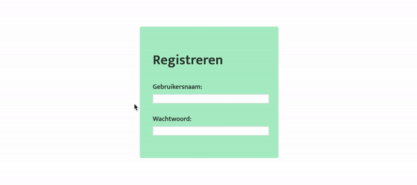

# Opdrachtbeschrijving

## Globale beschrijving
Je gaat een sign-up pagina maken met daarin een invoerveld voor het **wachtwoord** en voor de **gebruikersnaam**.
Met behulp van JavaScript ga je de waardes die de gebruiker intypt, valideren.

Iedere keer als de gebruiker de waarde in het gebruikersnaam-veld veranderd, checkt jouw script of de gebruikersnaam
geen `@` bevat. Als dat zo is, wordt de melding _"Gebruikersnaam mag geen @ bevatten"_ getoond. 

Iedere keer als de gebruiker de waarde van het wachtwoord-veld veranderd, checkt jouw script of het wachtwoord 
langer is dan 6 tekens. Als dat niet zo is, wordt de melding _"Wachtwoord is te kort, gebruik minimaal 6 tekens"_ 
getoond. Als de gebruiker het veld weer helemaal leeg heeft gemaakt, moet de melding ook verdwenen zijn.



De styling is niet zo belangrijk, maar als het goed is kun je dit zo namaken met CSS.

## Voordat je begint
1. Vergeet niet jouw CSS en JavaScript bestand te koppelen in de HTML
2. De basis van deze pagina kun je maken in HTML en CSS. Zorg ervoor dat wanneer je begint met jouw script, 
je jouw stappen **eerst uitschrijft in pseudo-code**.
3. _Dikke tip:_ denk eraan dat je in het script zowel specificeert wanneer de melding wél getoond moet worden als wanneer hij niet 
getoond moet worden. 

## Pseudocode
**Spoileralert: gebruik dit alleen als je er zelf niet uitkomt!**
```
// HTML & CSS
// 1. Maak een formulier in de HTML met daarin een <input> voor een gebruikersnaam en een voor het wachtwoord
// 2. Maak een <span> of <p> element voor beide invoervelden, waar de waarschuwing in kan.

// SCRIPT
// 1. Sla de referentie naar het gebruikersnaam-veld op
// 2. Sla de referentie naar het gebruikersnaam-waarschuwing element op
// 3. Zet een event listener op het gebruikersnaam-veld
// 4. Maak een functie die de event listener kan aanroepen als de gebruiker input geeft
// 5. Laat die functie checken of de huidige waarde van de input een '@' bevat
// 6. Als dit zo is, geef de waarschuwing weer
// 7. Als dit niet zo is, zorg dan dat de waarschuwing verdwijnt
// 8. Herhaal deze stappen voor het wachtwoord
```